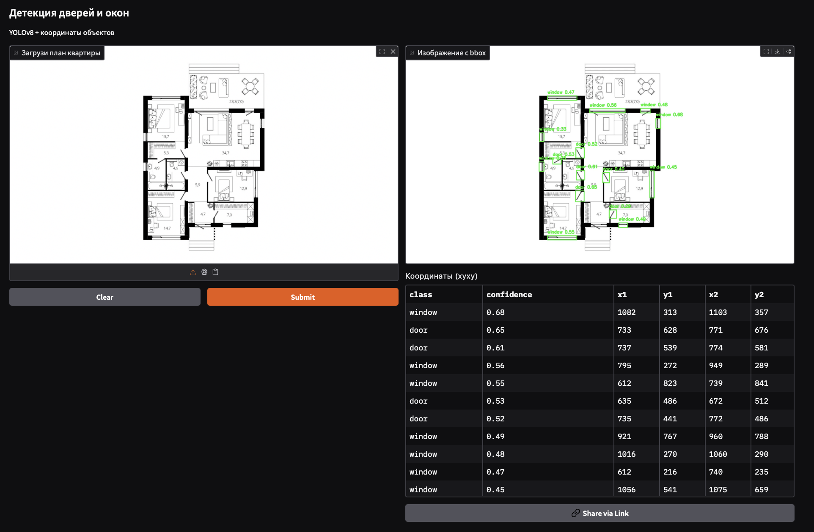

# XR_place_detection

Детектор дверей и окон на планах квартир/офисов.

Репозиторий содержит пайплайн сборки датасета из Roboflow, нормализацию разметки (унификация классов, конвертация полигонов → bbox), проверку качества, обучение YOLOv8 и веб-демо на Gradio.

Основной ноутбук - xr_place_learning.ipynb: в нём описана подготовка данных и ход обучения.

Для демонстрации создано Gradio-приложение на Hugging Face, куда можно загрузить план помещения и получить изображение с подсвеченными дверями/окнами и уровнями уверенности, а также таблицу с их координатами:  [Hugging Face Spaces — XR Place Detection](https://huggingface.co/spaces/SHANURAI/XR_place_gradio_app)

## Интерфейс 

